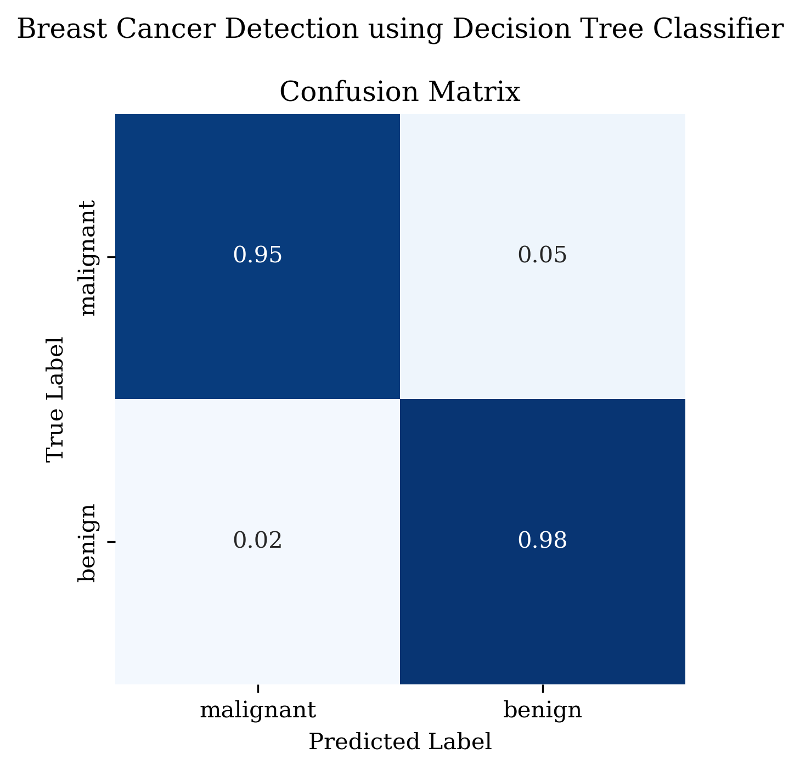
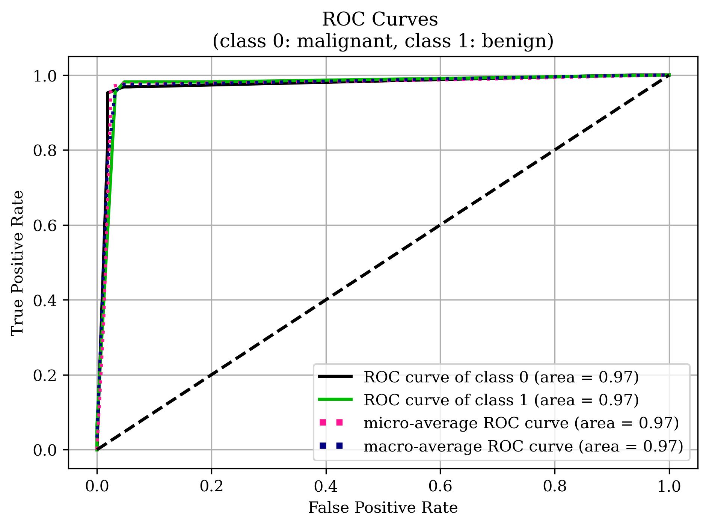
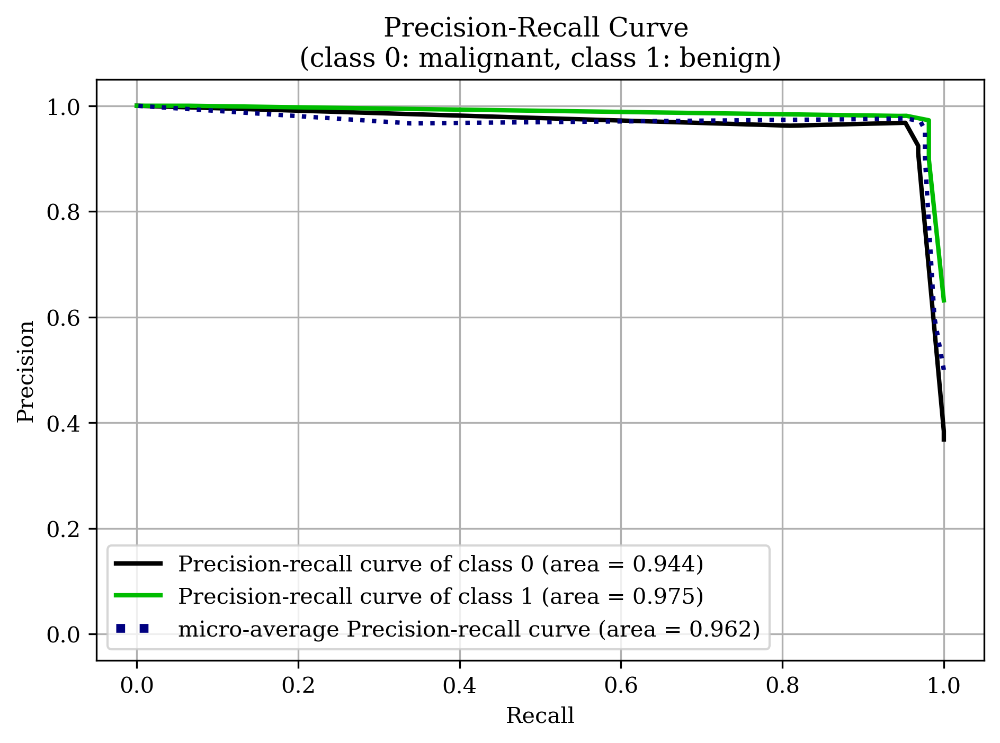
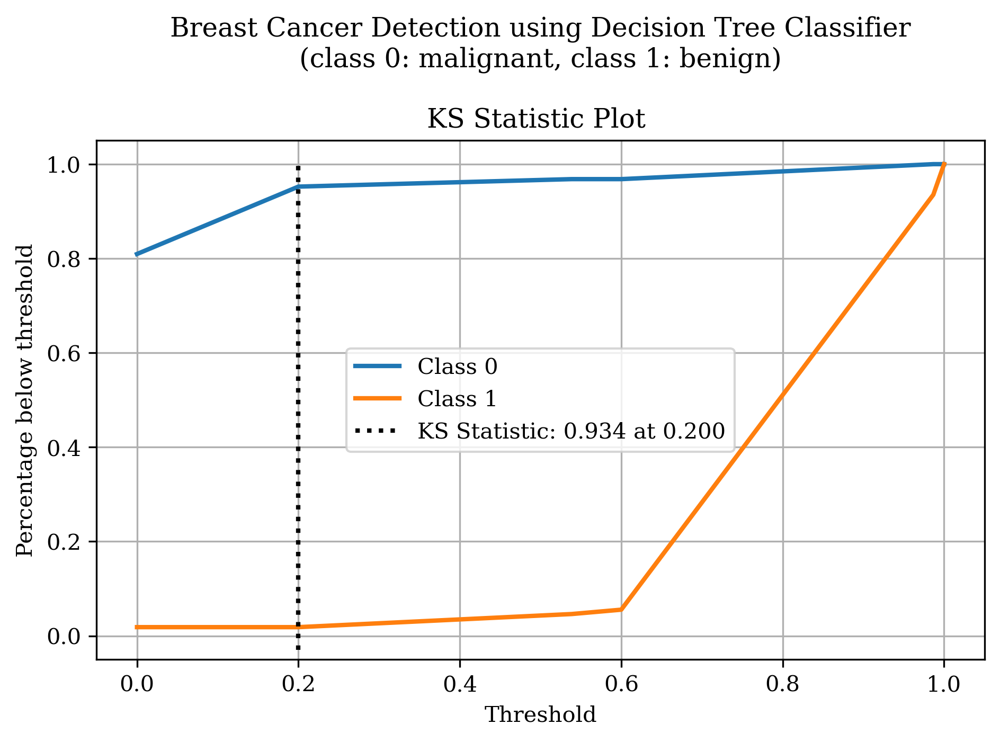
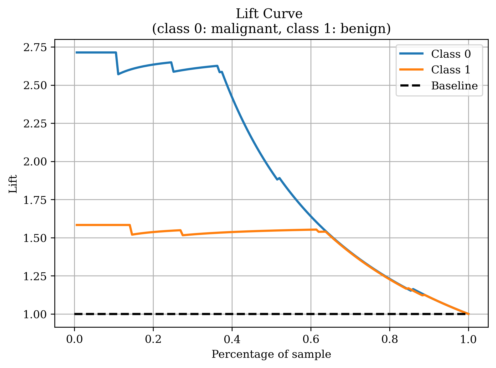
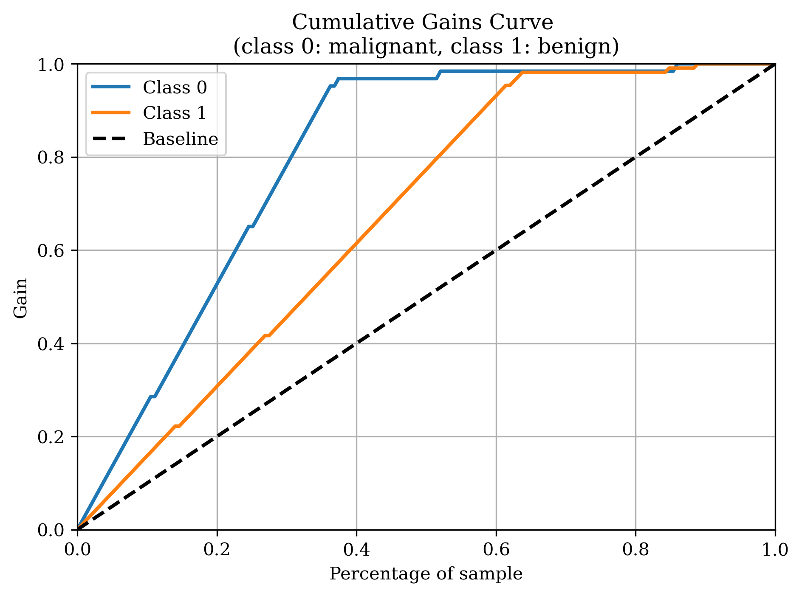
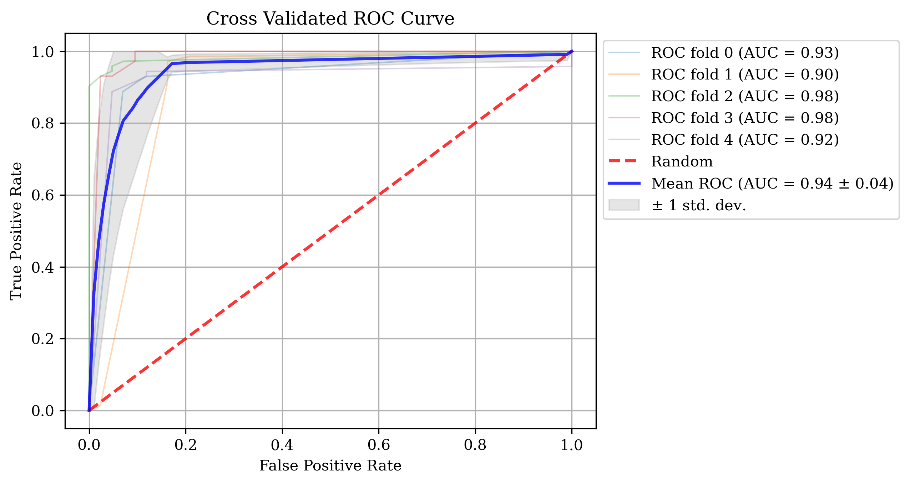
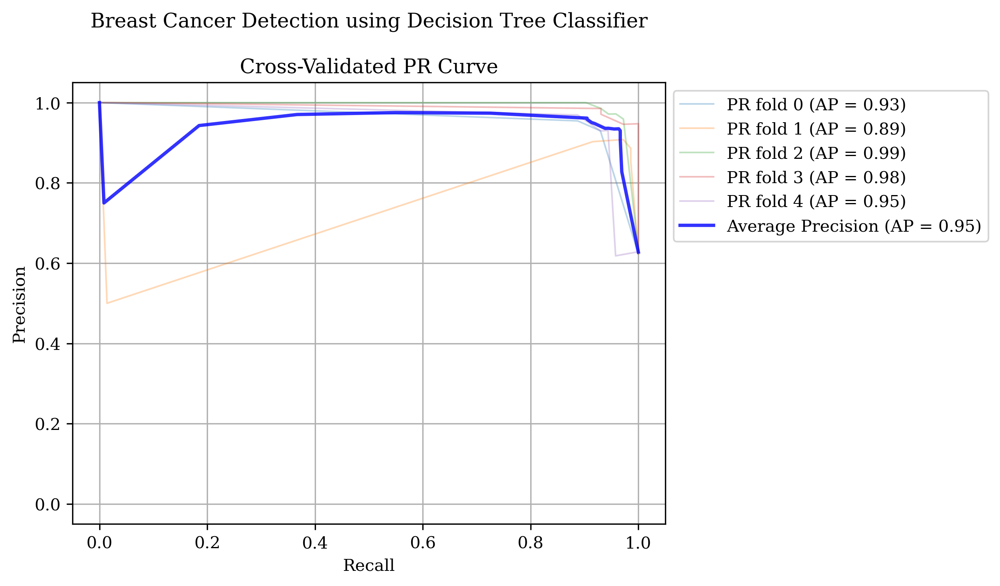
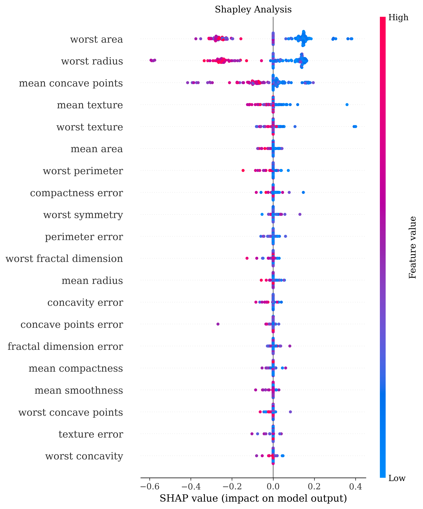

# Classification Utilities

This packages provides a simple convenience wrapper around some basic sklearn and scikit-plot utilities for classification. The only function available is `eval_classification()`. 

Metrics plotted - 
1. Confusion Matrix
2. Class-wise PR curve
3. Class-wise ROC curve

Additional metrics plotted if binary classification - 
1. KS Statistic Plot
2. Lift Curve
3. Cumulative Gain Plot
4. Cross-validated PR curve
5. Cross-validated ROC curve


## Installation

`pip install clfutils4r`

## Available Parameters

**For cross-validation on full dataset**

`untrained_model`: classifier object (untrained); this is used for cross-validation

`X`: Pandas DataFrame containing preprocessed, normalized, complete dataset

`y`: Pandas Series containing encoded labels for `X`

**For single run evaluation**

`y_test`: ground-truth encoded labels of test set

`y_pred`: binary predicted labels for test set

`y_pred_proba`: probabilist predictions per class for test set

**For Shapley analysis**

`make_shap_plot`: set `True` if you want to perform Shapley analysis

`trained_model`: classifier object (trained)

`X_train`: Pandas DataFrame containing preprocessed, normalized, complete train set

`X_test`: Pandas DataFrame containing preprocessed, normalized, complete test set

**For plotting**

`class_names`: list of unique classes

`RESULTS_DIR`: location to store results; directory will be created if it does not exist

`save`: set `True` if you want to save all results in RESULTS_DIR; defaults to `False`

`show`: display all results; useful in notebooks; defaults to `False`

## Example Usage
```python
import matplotlib.pyplot as plt
import numpy as np
import pandas as pd
import os

from sklearn import datasets
from sklearn.preprocessing import StandardScaler
scaler = StandardScaler()

## Load dataset: Example - breast cancer prediction
data = datasets.load_breast_cancer()
class_names = data.target_names
feature_names = data.feature_names
X = pd.DataFrame(data.data, columns=feature_names)
y = pd.Series(data.target)
for feat_name in feature_names:
    X[feat_name] = scaler.fit_transform(X[[feat_name]]) 

## Split into train and test sets
from sklearn.model_selection import train_test_split
X_train, X_test, y_train, y_test = train_test_split(X, y, test_size=0.30, random_state=42)

## Setup model
from sklearn.tree import DecisionTreeClassifier
model = DecisionTreeClassifier()
model_params = {'criterion': 'gini', 'max_depth': 3, 'min_samples_leaf': 5}
model.set_params(**model_params)

## Train model
model.fit(X_train, y_train)

## Evaluate model
from clfutils4r.eval_classification import eval_classification
y_pred = model.predict(X_test)
y_pred_proba = model.predict_proba(X_test)

eval_classification(untrained_model=DecisionTreeClassifier().set_params(**model_params), 
                    n_splits=5, class_names=class_names, 
                    X=X, y=y, 
                    make_shap_plot=True, trained_model=model, X_train=X_train, X_test=X_test,
                    y_test=y_test, y_pred=y_pred, y_pred_proba=y_pred_proba, 
                    show=True, save=True, RESULTS_DIR=os.getcwd()+'/results')

```
<!-- ### Confusion Matrix -->
<!--  -->


<!-- ### Class-wise ROC curve -->
<!--  -->


<!-- ### Class-wise PR curve -->
<!--  -->


<!-- ### KS statistic  -->
<!--  -->


<!-- ### Lift Curve  -->
<!--  -->


<!-- ### Cumulative Gain Curve  -->
<!--  -->


<!-- ### Cross-validated ROC curves -->
<!--  -->


<!-- ### Cross-validated PR curves -->
<!--  -->


<!-- ### Shapley Analysis Summary Plot -->
<!--  -->


## Developer Notes:
This package is the updated version of `bcutils4r` which supported only binary classification. `bcutils4r` is now defunct.