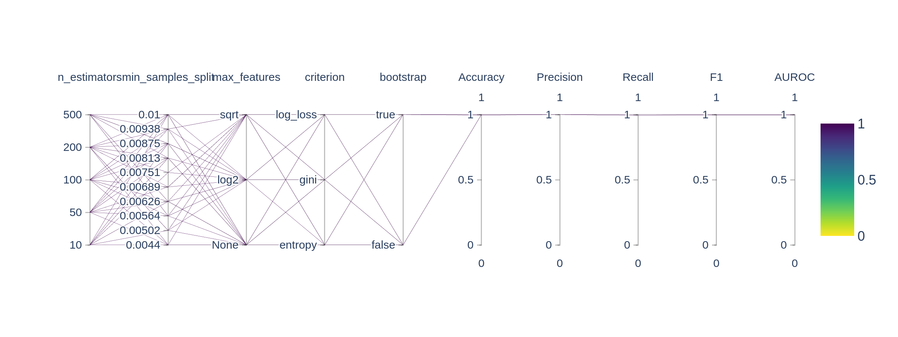
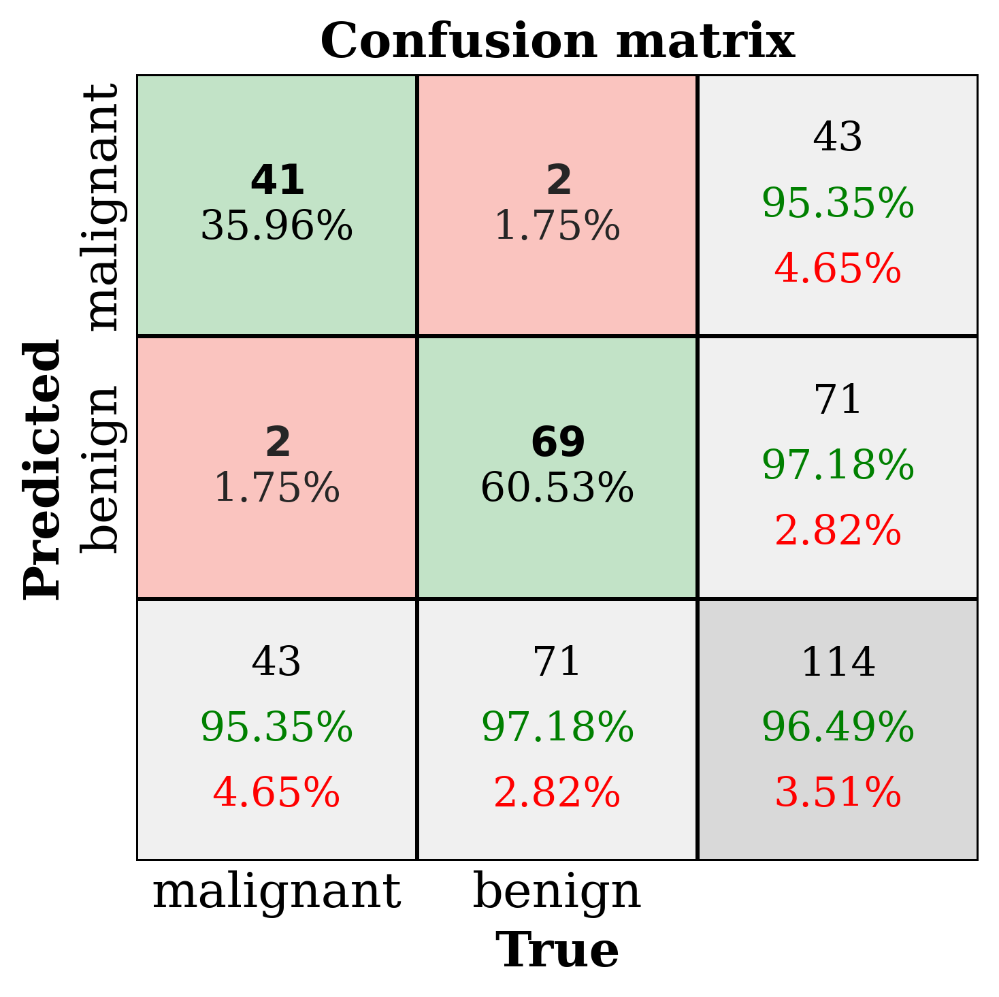
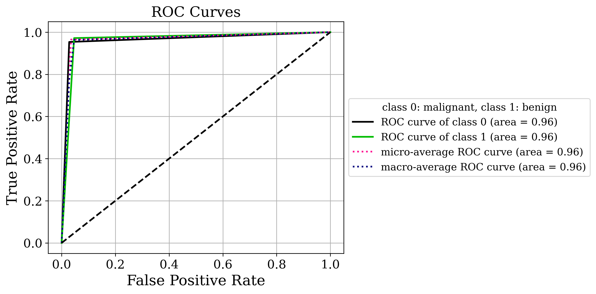
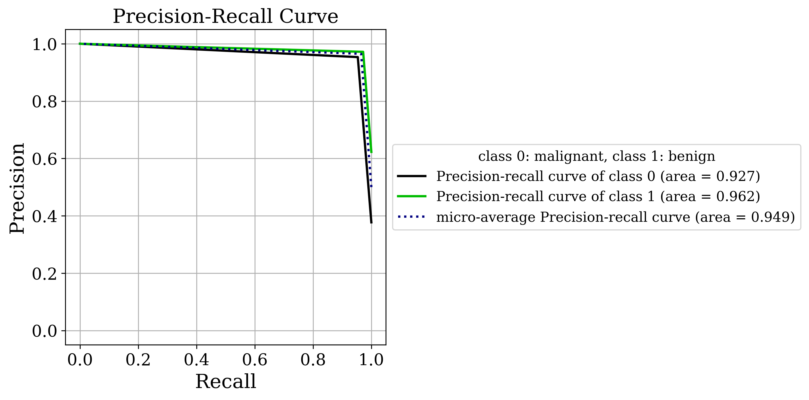
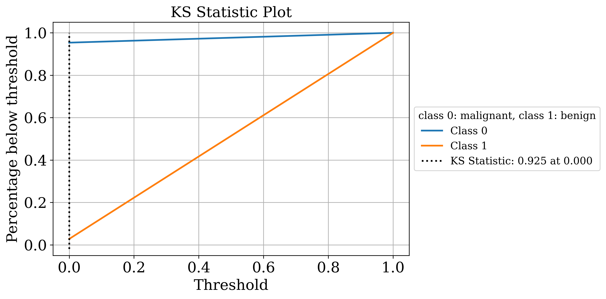
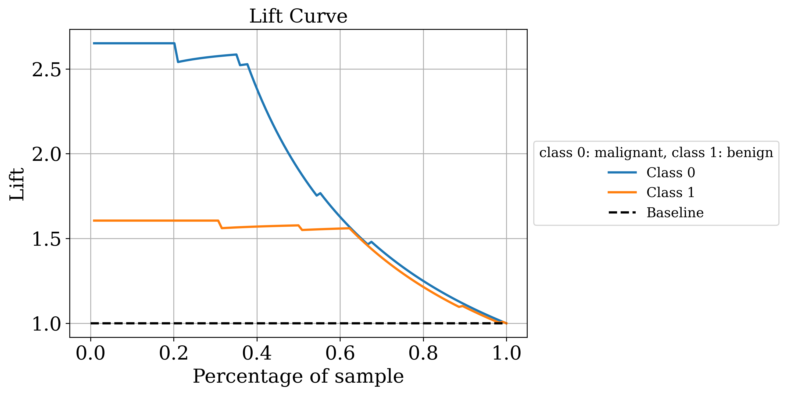
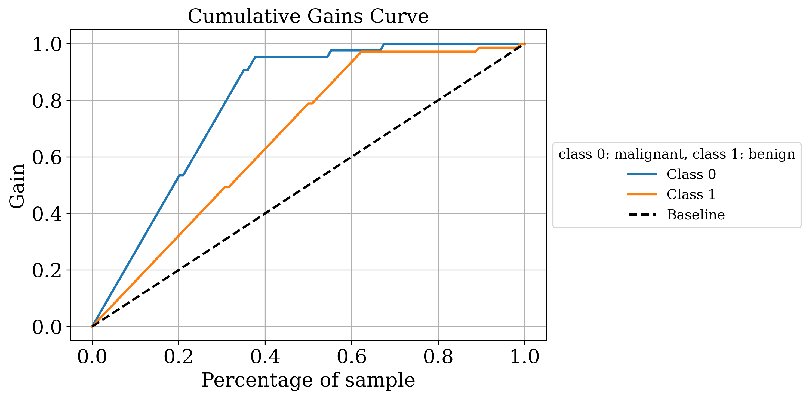
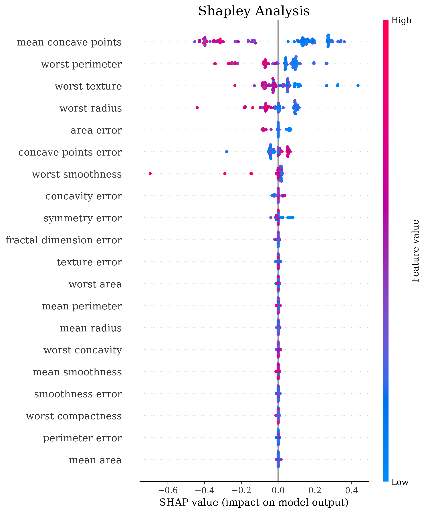

# Classification Utilities

This packages provides a simple convenience wrapper around some basic sklearn and scikit-plot utilities for classification. 
There are two modules available - `gridsearch_classification` and `eval_classification`.

## Installation

`pip install clfutils4r`

## Module `gridsearch_classification`:
Only function available is `gridsearch_classification()`

### Available Parameters

`X`: dataset.

`gt_labels`: ground truth labels.

`best_model_metric`: metric to use to choose the best model.

**For plotting**

`show`: whether to display the plots; this is used in a notebook.

`save`: whether to save the plots.

`save_dir`: if `save=True`, directory to save results in.
                                                        

## Module `eval_classification`: 
Only function available is `eval_classification()`

Metrics plotted - 
1. Confusion Matrix
2. Class-wise PR curve
3. Class-wise ROC curve

Additional metrics plotted if binary classification - 
1. KS Statistic Plot
2. Lift Curve
3. Cumulative Gain Plot
4. Cross-validated PR curve
5. Cross-validated ROC curve

### Available Parameters
**For cross-validation on full dataset**

`untrained_model`: classifier object (untrained); this is used for cross-validation

`X`: Pandas DataFrame containing preprocessed, normalized, complete dataset

`y`: Pandas Series containing encoded labels for `X`

**For single run evaluation**

`y_test`: ground-truth encoded labels of test set

`y_pred`: binary predicted labels for test set

`y_pred_proba`: probabilist predictions per class for test set

**For Shapley analysis**

`make_shap_plot`: set `True` if you want to perform Shapley analysis

`trained_model`: classifier object (trained)

`X_train`: Pandas DataFrame containing preprocessed, normalized, complete train set

`X_test`: Pandas DataFrame containing preprocessed, normalized, complete test set

**For plotting**

`class_names`: list of unique classes

`RESULTS_DIR`: location to store results; directory will be created if it does not exist

`save`: set `True` if you want to save all results in RESULTS_DIR; defaults to `False`

`show`: display all results; useful in notebooks; defaults to `False`

## Example Usage
```python

import collections
import matplotlib.pyplot as plt
%matplotlib inline
import numpy as np
import pandas as pd
import os

from sklearn import datasets
from sklearn.preprocessing import StandardScaler
scaler = StandardScaler()

## Load dataset: Example - breast cancer prediction
data = datasets.load_breast_cancer()
class_names = [str(x) for x in data.target_names]
feature_names = [str(x) for x in data.feature_names]

X, y = data.data, data.target
X = scaler.fit_transform(X)

## Split into train and test sets
from sklearn.model_selection import train_test_split
X_train, X_test, y_train, y_test = train_test_split(X, y, test_size=0.30, random_state=42)

## Grid search for best model
from gridsearch_classification import gridsearch_classification
save_dir = "gridsearch_results"
os.makedirs(save_dir, exist_ok=True)
best_model, grid_search_results = gridsearch_classification(X=X_train,                    # dataset
                                                            gt_labels=y_train,            # ground truth labels
                                                            best_model_metric="F1",       # metric to use to choose the best model
                                                            show=True,                    # whether to display the plots; this is used in a notebook
                                                            save=True, save_dir=save_dir  # whether to save the plots
                                                        )

## Predict on test set
y_pred = best_model.predict(X_test)
y_pred_proba = best_model.predict_proba(X_test)

## Evaluate best model on test set
from eval_classification import eval_classification
## Make metrics plots
eval_classification(make_metrics_plots=True, y_test=y_test, y_pred=y_pred, y_pred_proba=y_pred_proba,  
                    class_names=class_names, feature_names=feature_names,
                    titlestr="Breast Cancer Classification",
                    show=True, save=True, 
                    RESULTS_DIR=os.getcwd()+'/test_results')

```
<!-- ### Grid Search -->


<!-- ### Confusion Matrix -->

<!--  -->

<!-- ### Class-wise ROC curve -->

<!--  -->

<!-- ### Class-wise PR curve -->

<!--  -->

<!-- ### KS statistic  -->

<!--  -->

<!-- ### Lift Curve  -->

<!--  -->

<!-- ### Cumulative Gain Curve  -->

<!--  -->

<!-- ### Shapley Analysis Summary Plot -->

<!--  -->


## Developer Notes:
This package is the updated version of `bcutils4r` which supported only binary classification. `bcutils4r` is now defunct.

## Credits:
1. For pretty confusion matrix - https://github.com/phongsathorn1/pretty-confusion-matrix
2. Scikit Plot package  - https://scikit-plot.readthedocs.io/en/stable
3. Shapley Analysis - https://shap-lrjball.readthedocs.io/en/latest/